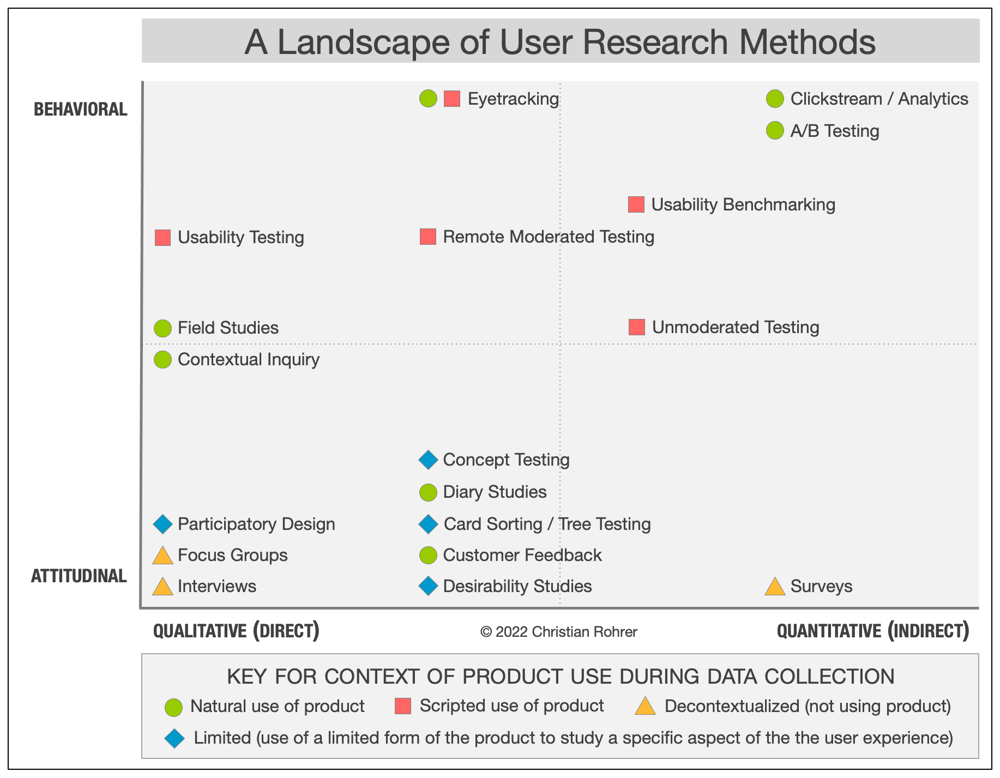

*Jesse James Garrett*

## Qu'est-ce que la recherche UX

Qualité du vécu de l'utilisateur dans des environnements numériques ou physiques.
Ergonomie, utilisabilité

Considérer l'ensemble des caractéristiques et des besoins des utilisateurs lors du développement des produits

interactions personne-système
**une composante non expérientielle :** qui se rattache à la fonction utilitaire
**une composante expérientielle :** qui renvoie au ressenti et aux réponses cognitives et émotionnelles de la situation d’interaction

contexte / subjectivité (biais cognitif)

La **UX Research** (ou recherche utilisateur) désigne les méthodes employées pour comprendre les attentes des utilisateurs d’un produit ou service.

Les résultats des investigations alimentent la réflexion et les choix futurs de l’équipe, en design d’interaction et en [design d’interface](https://www.usabilis.com/expertise/conception-dinterface/).

**Attitudinal vs. Behavioral (comportemental)**

**attitudinale :** ce que les individus disent et expriment
**comportemental :** actions qui peuvent être différentes de leurs paroles.

**Qualitative vs. Quantitative**

**Quantitatif :** collectent et analysent des données pour généraliser les résultats d’un échantillon d’une population cible (bcp de données)
**Qualitatif :** recueillent des informations sur les utilisateurs en les observant, en menant des entretiens individuels ou de groupes
comprendre les actes des consommateurs et la dimension émotionnelle de l’expérience des individus ciblés

## Connaître ses utilisateurs

### Personnas

La méthode des personas consiste à créer une représentation fictive mais réaliste des utilisateurs du produit numérique ou du service.
portrait-robot d’un être humain pour les incarner, à partir de ce que l’on sait d’eux

- mieux identifier leurs attentes, besoins et ressentis
- interface utilisateur améliorée, alignée sur les objectifs réels de l’usager
- exit opinions personnelles ou des préjugés divergents
- **différentes catégories d’utilisateurs** (quelqu'un qui veut d'inscrire à l'asso, un adhérent qui veut montrer son travail...)

### Cartographie

#### User journey (experience map)

représentation visuelle de l’expérience globale d’un utilisateur
représentation des actions, pensées et émotions des utilisateurs durant la réalisation d’une tâche, ou pour atteindre un objectif

## Méthodes de recherche essentielles

### Entretiens utilisateurs
étape au tout début du projet, avant le prototypage
**Attitudinal**
- Les expériences vécues par les utilisateurs, ce qui a été mémorable et pourquoi
- Les points de douleur des utilisateurs au cours d'une expérience
- Ce que les utilisateurs pensent ou ressentent à propos d'un sujet, d'un événement ou d'une expérience
- Ce qui préoccupe les utilisateurs
- Les modèles mentaux des utilisateurs
- Les motivations, aspirations et désirs des utilisateurs

Aide à définir les besoins de l'utilisateur, connaître plus en profondeur son ressenti, identifier des *painpoints* à corriger.
Orienter les questions par un objectif
- Qu'est-ce qui incite les utilisateurs à envisager et à essayer notre produit ?
- Quels sont les hauts et les bas de leur expérience ?
- Quel est le degré de connaissance du processus des utilisateurs ?
- Qu'est-ce qui pousse les utilisateurs à abandonner le produit ?
### Tests utilisateurs
étape pendant le développement du projet, après le prototypage
au moins 5 utilisateurs
**Comportemental**
- Identifier les problèmes liés à la conception du produit ou du service
- Découvrir les possibilités d'amélioration
- Apprendre à connaître le comportement et les préférences de l'utilisateur cible
Permet de concevoir itérativement en observant les interactions des utilisateurs avec le design UI.
1. Donner une tâche à un participant
2. Le participant la réalise en "pensant à haute voix"
3. Il rend compte de son expérience
**Mesures quantitatives :** Réussite et temps d'une tâche
Aussi A/B Testing, avec click tracking

### Audit d'accessibilité
Standards Web Content Accessibility Guidelines (WCAG)

**Handicaps**
- Visuel
- Auditif
- Moteur
- Cognitif
- Neurologique
- Situationnel

**Solutions**
- Rédactionnel inclusif
- texte alternatif aux images
- sémantique, labels aux champs de formulaires
- contrastes de couleurs
- sous-titres sur les vidéos

## Architecture de l'information
Rendre la visite plus intuitive
### Arborescence
- comment sont organisés les menus ?
- Comment trouver quelle information ?
- Quels sont nos objectifs primaires ? Secondaires ?
- Via quels parcours utilisateur ?

Peut-être définie selon l'attente de l'utilisateur par un exercice de "tri de cartes".

### Zoning/wireframe et prototype

Puis conception UI et prototypage

## Outils

Maze, Hotjar, Matomo
[Mobbin](https://mobbin.com/)
